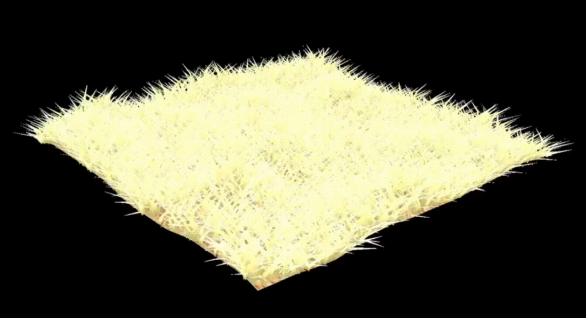

# Vulkan Grass Rendering

**University of Pennsylvania, CIS 565: GPU Programming and Architecture, Project 5**  
**Author:** Yi Liu  

## Tested On

- **OS:** Windows 11 Home, Version 24H2 (OS Build 26100.4061)  
- **CPU:** Intel(R) Core(TM) i9-14900K @ 3.20GHz, 24 cores / 32 threads  
- **RAM:** 64 GB  
- **GPU:** NVIDIA GeForce RTX 4090, 24 GB VRAM  
- **Environment:** Visual Studio 2022, CUDA 12.6, CMake 3.27  

---

This project implements real-time grass simulation and rendering using Vulkan. Grass blades are modeled as dynamic quadratic Bézier curves and animated using GPU-based compute shaders. The pipeline features frustum, distance, and orientation-based culling, as well as tessellation shaders for efficient geometry amplification.

---

## Showcase

The following GIFs demonstrate real-time simulation and rendering of thousands of animated grass blades:

  
*Compute-based animation and tessellation-driven rendering*

  
*Grass tiles smoothly culled by distance from the camera*

---

## Key Features

- **Physics-Based Animation**  
  Grass blades bend and sway in response to wind and gravity, simulated entirely on the GPU using compute shaders that update Bézier control points.

- **Bézier Curve Representation**  
  Each blade is defined as a quadratic Bézier curve with randomized properties (height, width, orientation, stiffness), allowing dynamic, varied blade geometry.

- **Tessellation Pipeline**  
  Vulkan tessellation control and evaluation shaders convert each animated Bézier curve into screen-space geometry at runtime.

- **Culling Optimizations**  
  - *View-Frustum Culling*: Discards blades outside the camera’s view.  
  - *Orientation Culling*: Removes blades facing away from the viewer.  
  - *Distance Culling*: Uses camera distance to reduce density in the far field.

- **Free-Fly Camera Controls**  
  Interactively explore the grass field with a full 3D camera system:
  - `WASD`: Move horizontally
  - `Q` / `E`: Move downward / upward
  - Scroll Wheel: Zoom in / out
  - Right-click + Drag: Rotate the camera viewpoint

